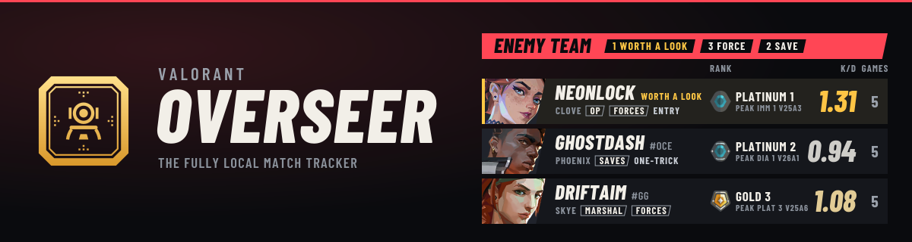
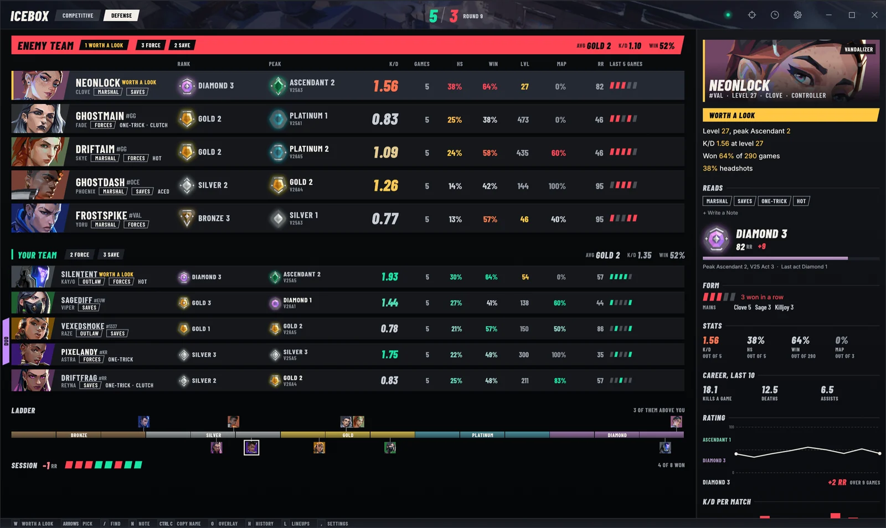
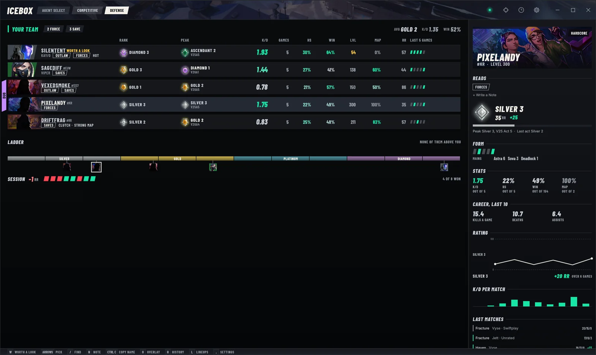
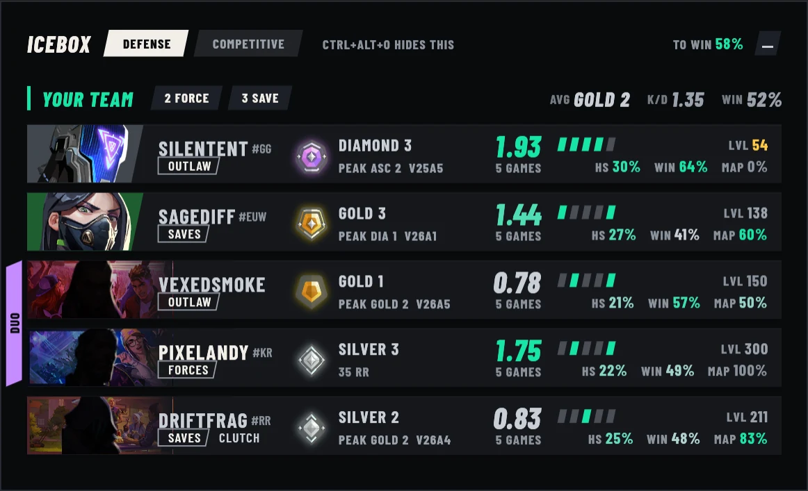
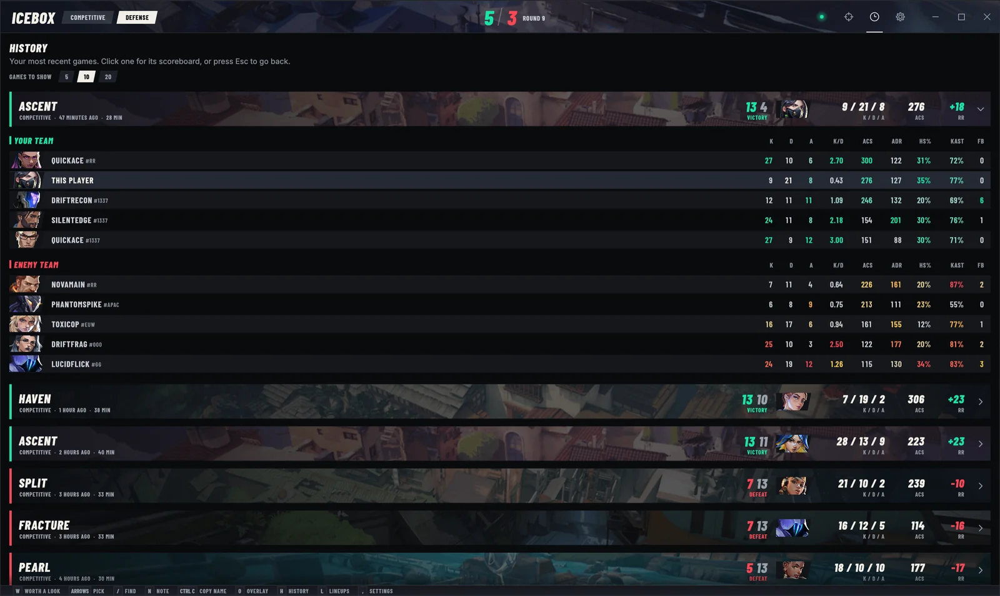
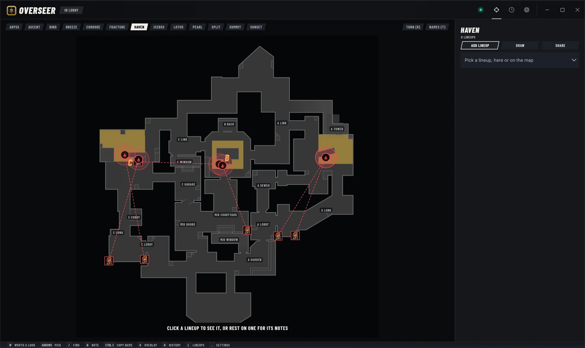

# Valorant Overseer

Valorant Overseer is a match tracker for VALORANT on Windows that runs entirely
on your PC. It shows everyone in your lobby and your match with their rank,
peak rank, K/D and win rate, who queued together, and whether an account looks
like a smurf. It also keeps your match history, has a lineup planner with clips
for every map, puts an overlay over the game, and can hide you from your
friends in Riot chat.

**[Download Valorant Overseer for Windows](https://github.com/SomethingObvious/Valorant-Overseer/releases/latest)**

There's more on the [Valorant Overseer site](https://somethingobvious.github.io/Valorant-Overseer/).

## Screenshots

These come from the app's demo mode, so the players are made up.

## How It Works

Overseer reads your match from the Riot Client's own local API, the same one
the client uses to show your party, and asks Riot's servers for the recent
games of the players in it. It never touches the game itself: it doesn't read
the game's memory, and it never clicks, types or locks in an agent.

There's no account, no server of its own and no tracking. Agent and map art
comes from valorant-api.com, and nothing about you is sent there. Your notes,
lineups and history stay in the install folder, and Your Data in settings
opens it. The app never updates itself.

## Installing

Overseer runs on Windows 10 and 11. Download `Valorant-Overseer-Setup.exe`,
open it and pick your region. It installs into
`AppData\Local\Programs\Valorant Overseer` with its own copy of Python and
doesn't need admin rights. If Windows says it protected your PC,
click More info, then Run anyway.

Then open VALORANT and join a lobby. Running setup again repairs or upgrades it
and keeps your data, and it uninstalls from Settings > Apps.

Lineup clips need yt-dlp and FFmpeg. Setup installs them with winget, and
Update Clip Tools in settings updates them when a link stops downloading.

## Notice

Valorant Overseer isn't made or endorsed by Riot Games.

Working on the code? `AGENTS.md` and `crates/README.md` cover that.

## Licence

Overseer is under the [PolyForm Strict License 1.0.0](LICENSE.md). You can use
it for anything noncommercial, but you can't sell it, use it in a business,
share copies of it, or publish a changed version of it.
